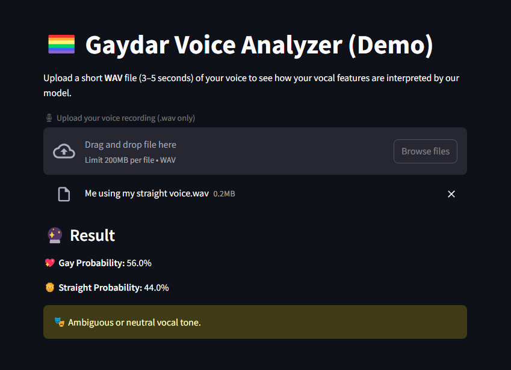

# 🏳️‍🌈 Gaydar Voice Analyzer

[🔗 Live Preview](https://gaydar.streamlit.app/)

**Gaydar Voice Analyzer** is a fun and privacy-focused tool that analyzes short audio clips to infer vocal expression trends. It uses machine learning to classify male voices based on pitch, jitter, and other features — inspired by academic research.

> ✨ This project is LGBTQ+ owned and built for educational/demo purposes only.  
> 🛡️ No data is stored. No judgment. Just vibes.

---

## 📸 Demo

<p align="center">
  
</p>

---

## 🚀 Features

- 🎙️ Upload WAV voice clips (3–5s)
- 📊 Predict “gay” vs “straight” vocal traits using AI
- 🔒 100% local processing (no voice saved or uploaded)
- 🧠 Based on real acoustic feature datasets

---

## 🧰 Tech Stack

- `Streamlit` – for UI
- `scikit-learn` – for the ML model
- `librosa` + `soundfile` – for audio processing
- Dataset: [Figshare – Acoustic Features by Orientation](https://figshare.com/articles/dataset/Dataset_of_speech_acoustic_features_from_gay_men_heterosexual_men_and_heterosexual_women_/11826636)

---

## ⚙️ Setup & Run

### 1. Clone this repo

```bash
git clone https://github.com/yourusername/gaydar-voice-analyzer.git
cd gaydar-voice-analyzer
```

### 2. Install dependencies

```bash
pip install -r requirements.txt
```

### 3. Run locally

```bash
streamlit run gaydar_streamlit_app.py
```

---

## 📁 Files

| File | Description |
|------|-------------|
| `gaydar_model.pkl` | Pretrained model using RandomForest |
| `gaydar_streamlit_app.py` | Main app UI |
| `requirements.txt` | Dependencies list |
| `README.md` | This file |

---

## 🧠 Ethics Note

This app is for **entertainment and education** only. It does **not determine identity**, nor should it be used to stereotype or label anyone.

We encourage exploration of voice and gender/sexuality with curiosity and respect. ❤️

---

## 📬 Contact

Built by [muso.sk](https://muso.sk)